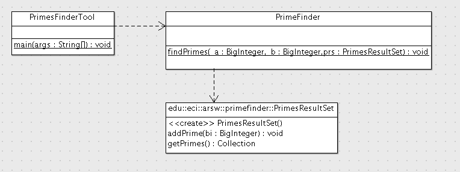

## Escuela Colombiana de Ingeniería
## Arquitecturas de Software - ARSW
## Parcial Primer Tercio
 
Con el fin de contribuír al desarrollo de sistemas criptográficos cada vez más robustos, se quiere desarrollar una plataforma distribuida que apoye la búsqueda de nuevos números primos (usado en los mecanismos de seguridad basados en llave pública). Para tal fin, usted va a desarrollar una herramienta de escritorio que se distibuirá entre las personas que quieran contribuir con los tiempos ociosos de sus equipos de cómputo (cuando el equipo está prendido pero sin actividad alguna), y la cual aprovechará dichos espacios ociosos para realizar la búsqueda.

Por ahora, se cuenta con una herramienta basada en el siguiente modelo, la cual simplemente busca números primos en un intervalo determinado, y sin aprovechar las capacidades multi-núcleo de los equipos de escritorio modernos:



### Nota: 

Puntos 1 y 2: proyecto 'PrimesFinderDesktopTool'.
Punto 3: proyecto PrimesAPI.

1. [33%] Haga que el programa divida y paralelice la búsqueda de los números primos dentro del intervalo dado en exactamente 4 hilos de ejecución.

2. [33%] Haga que el programa mantenga inactivos los hilos (sin esperas activas!), hasta tanto se detecte que el computador no tiene actividad (en este caso, cuando se completen 10 segundos sin detectar movimiento del mouse). Del mismo modo, una vez se detecte actividad del mouse, los hilos deberían nuevamente suspenderse (de nuevo, hasta tanto se detece la inactividad del mouse por al menos 10 segundos). Al terminarse la búsqueda en el intervalo dado, el programa debe funcionar exactamente igual que en la versión original: imprimiendo los resultados capturados en el objeto PrimeResultSet:

    ```java
    System.out.println(prs.getPrimes());
    ```
    * Nota: la clase PrimeResultSet ya es Thread-safe y NO debe ser modificada!.

3. [33%] La clase PrimeResultSet automáticamente detecta cuando hay un API REST con la URL _http://localhost:8080/primes_ para el registro y consulta de los números primos encontrados a través de la aplicación de escritorio. El recurso _http://localhost:8080/primes_ usa como representación un objeto json que tiene el nombre del cliente que lo descubrió (para darle crédito), y el número primo correspondiente, tal como este:

    ```javascript
    {"user":"john","prime":"32416190071"}
    ```

    Sobre la base del proyecto suministrado (aplicación SpringBoot), desarrolle el API requerido por el cliente, el cual mantenga en memoria (por ahora) los números primos identificados, teniendo en cuenta:

    * Se soporten los verbos GET y POST para el recurso '/primes', y GET para el recurso /primes/{primenumber}
    * Una vez registrado un número primo, no se permita que sea registrado de nuevo con un nombre de usuario diferente (retornando el código de error respectivo).
    * No se den condiciones de carrera ni bloqueos innecesarios.
    * Se debe realizar la implementación de la clase PrimeServiceStub y conectarlos con el controlador PrimesController usando inyección de dependencias


## Entrega

Siga al pie de la letra estas indicaciones para la entrega de este punto. EL
HACER CASO OMISO DE ESTAS INSTRUCCIONES PENALIZARÁ LA NOTA.

1. Limpie los dos proyectos. Entre a los directorios 'PrimesFinderDesktopTool' y 
'PrimesAPI' y ejecute:


	```bash
    $ mvn clean
    ```

1. Configure su usuario de GIT

	```bash
    $ git config --global user.name "Juan Perez"
    $ git config --global user.email juan.perez@escuelaing.edu.co
    ```

2. Desde el directorio raíz (donde está este archivo README.md), haga commit de
   lo realizado.

	```bash
    $ git add .
    $ git commit -m "entrega parcial - Juan Perez"
    ```


3. Desde este mismo directorio, comprima todo con: (no olvide el punto al final de la instrucción)

	```bash
    $ zip -r APELLIDO.NOMBRE.zip .
    ```
4. Abra el archivo ZIP creado, y rectifique que contenga lo desarrollado.

4. Suba el archivo antes creado (APELLIDO.NOMBRE.zip) en el espacio de moodle correspondiente.

5. IMPORTANTE!. Conserve una copia de la carpeta y del archivo .ZIP.
 
